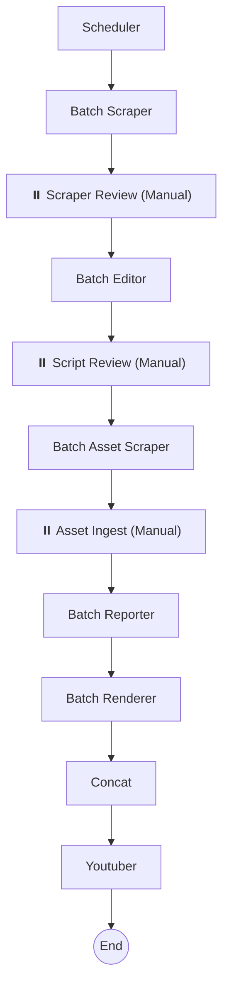

# 🗞️ NewsGenerator: Automated News-to-Video Pipeline

NewsGenerator is a powerful automation system designed to transform news articles from various URLs into high-quality, professional-looking news videos. It leverages Large Language Models (LLMs) for script generation, LangGraph for workflow orchestration, and Remotion for programmatic video rendering.

## 🚀 Key Features

- **Multi-Source Scraping**: Automatically extracts content from a list of URLs (BBC, WSJ, etc.).
- **AI-Powered Editorial**: Uses LLMs to refine news content, write scripts (in Chinese), and generate visual instructions (storyboards).
- **Human-in-the-Loop (HITL)**: Provides three strategic manual review points to ensure quality:
  1.  **Scraper Review**: Verify and edit scraped news data.
  2.  **Script Review**: Polish the generated script and visual prompts.
  3.  **Asset Review**: Double-check or replace downloaded images/videos before rendering.
- **Automated Asset Sourcing**: Automatically searches and downloads images based on the generated storyboard.
- **High-Quality Rendering**: Uses **Remotion** (React/TypeScript) to render pixel-perfect video segments.
- **Smart Concatenation**: Merges individual news segments into a final full-length video, including background music and intro/outro management.

## 🏗️ Architecture & Workflow

The system is built as a **StateGraph** using LangGraph, ensuring a robust and resumable workflow.



### Core Components

- **`run.py`**: The main entry point. Automatically fetches news via RSS and manages the workflow.
- **`src/graph.py`**: Defines the LangGraph workflow logic, checkpointers, and nodes.
- **`src/agents/`**: Contains specialized agents:
  - `scraper.py`, `editor.py`: Content ingestion and script generation.
  - `ingest.py`: Manual review node for asset verification and storyboard reloading.
  - `youtuber.py`: Generates YouTube metadata (titles, chapters, desc).
- **`remotion_project/`**: The React-based video engine.

## 🛠️ Prerequisites

- **Python 3.10+**
- **Node.js 18+ & npm**
- **API Keys**: Required in a `.env` file (OpenAI, Google GenAI, etc.).
- **Playwright**: For web scraping.

## 📦 Installation

1.  **Clone the repository** (or navigate to the directory).
2.  **Setup Python Environment**:
    ```bash
    python -m venv .venv
    source .venv/bin/activate
    pip install -r requirements.txt
    playwright install
    ```
3.  **Setup Rendering Engine**:
    ```bash
    cd remotion_project
    npm install
    ```
4.  **Configure Environment**:
    Create a `.env` file in the root directory and add your API keys:
    ```env
    OPENAI_API_KEY=your_key_here
    GOOGLE_API_KEY=your_key_here
    # ... other keys
    ```

## 🎮 Usage

1.  **Configure URLs**: Open `run.py` and paste your target news URLs into the `URLS_TEXT` block.
2.  **Start the System**:
    ```bash
    python run.py
    ```
3.  **Interact with the Workflow**: The terminal will pause at several points (Scraper, Script, and Asset review). Follow the instructions in the console to check/edit files in `output/` and press **ENTER** to proceed.
4.  **Resuming from Interrupt**: If the workflow is interrupted (via `checkpoint`), it can be resumed by calling `app.invoke(None, config)` with the same `thread_id`. The current `run.py` handles this loop automatically.
5.  **Final Video**: Once finished, the concatenated video and YouTube metadata (`output/youtube_metadata.txt`) will be ready.

## 📁 Project Structure

```text
.
├── run.py                 # Main entry point (Resumable workflow)
├── src/
│   ├── graph.py           # LangGraph workflow definition (w/ interrupts)
│   ├── state.py           # State management (AgentState & Storyboard)
│   └── agents/            # Specialized agents (Ingest, Youtuber, etc.)
├── remotion_project/      # Remotion/React video rendering logic
├── output/                # Intermediate outputs, storyboards, and final videos
├── assets/                # Static assets (logos, BGM, bg.mp4)
└── requirements.txt       # Python dependencies
```

## 📝 License

Internal Project / All Rights Reserved.
