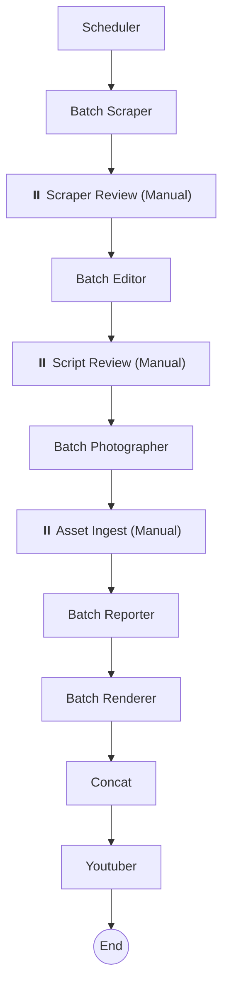

# 🗞️ NewsGenerator: Automated News-to-Video Pipeline

NewsGenerator is a powerful automation system designed to transform news articles from various URLs into high-quality, professional-looking news videos. It leverages Large Language Models (LLMs) for script generation, LangGraph for workflow orchestration, and Remotion for programmatic video rendering.

## 🚀 Key Features

- **Multi-Source Scraping**: Automatically extracts content from a list of URLs (The Globe and Mail, etc.).
- **Global English Support**: Full pipeline conversion to English, including LLM script generation and metadata.
- **Azure TTS**: High-quality English voiceover using Azure's `en-US-AndrewMultilingualNeural` voice.
- **AI-Powered Editorial**: Uses LLMs to refine news content, write scripts (in English), and generate visual instructions (storyboards).
- **Human-in-the-Loop (HITL)**: Provides three strategic manual review points to ensure quality.
- **Automated Photographer**: Automatically searches and downloads images based on the generated storyboard.
- **Interactive UI**: Gradio-based dashboard for one-click generation and step-by-step testing.

## 🏗️ Architecture & Workflow

The system is built as a **StateGraph** using LangGraph, ensuring a robust and resumable workflow.



### Core Components

- **`run.py`**: The main entry point. Automatically fetches news via RSS and manages the workflow.
- **`src/graph.py`**: Defines the LangGraph workflow logic, checkpointers, and nodes.
- **`src/agents/`**: Contains specialized agents:
  - `scraper.py`, `editor.py`: Content ingestion and script generation.
  - `ingest.py`: Manual review node for asset verification and storyboard reloading.
  - `youtuber.py`: Generates YouTube metadata (titles, chapters, desc).
- **`remotion_project/`**: The React-based video engine.

## 🛠️ Prerequisites

- **Python 3.10+**
- **Node.js 18+ & npm**
- **API Keys**: Required in a `.env` file (OpenAI, Google GenAI, etc.).
- **Playwright**: For web scraping.

## 📦 Installation

1.  **Clone the repository** (or navigate to the directory).
2.  **Setup Python Environment**:
    ```bash
    python -m venv .venv
    source .venv/bin/activate
    pip install -r requirements.txt
    playwright install
    ```
3.  **Setup Rendering Engine**:
    ```bash
    cd remotion_project
    npm install
    ```
4.  **Configure Environment**:
    Create a `.env` file in the root directory and add your API keys:
    ```env
    OPENAI_API_KEY=your_key_here
    GOOGLE_API_KEY=your_key_here
    # ... other keys
    ```

## 🎮 Usage

### Method A: Interactive Gradio UI (Recommended)

This provides a visual dashboard to run the pipeline or test individual steps.

```bash
source .venv/bin/activate
python3 app.py
```

Open the provided local URL (usually `http://127.0.0.1:7860`) in your browser.

### Method B: Console Execution (Manual/Batch)

1.  **Configure URLs**: Open `run.py` or use the RSS feeds configured in `src/agents/scraper.py`.
2.  **Start the System**:
    ```bash
    python run.py
    ```
3.  **Interact with the Workflow**: The terminal will pause at several points (Scraper, Script, and Asset review). Follow the instructions in the console to check/edit files in `output/` and press **ENTER** to proceed.

### Method C: LangGraph Studio (Visual Debugging)

For a fully interactive, visual way to run and debug the workflow:

1.  **Install requirements**:
    ```bash
    pip install "langgraph-cli[all]"
    ```
2.  **Start the Dev Server**:
    In the project root, run:
    ```bash
    source .venv/bin/activate
    langgraph dev
    ```
3.  **Open in Browser**:
    Follow the printed link (e.g., `https://smith.langchain.com/studio/...`) to see the node graph. You can start the pipeline from any node, view state changes, and handle interrupts visually.

## 📁 Project Structure

```text
.
├── run.py                 # Main entry point (Resumable workflow)
├── src/
│   ├── graph.py           # LangGraph workflow definition (w/ interrupts)
│   ├── state.py           # State management (AgentState & Storyboard)
│   └── agents/            # Specialized agents (Ingest, Youtuber, etc.)
├── remotion_project/      # Remotion/React video rendering logic
├── output/                # Intermediate outputs, storyboards, and final videos
├── assets/                # Static assets (logos, BGM, bg.mp4)
└── requirements.txt       # Python dependencies
```

## 📝 License

Internal Project / All Rights Reserved.
